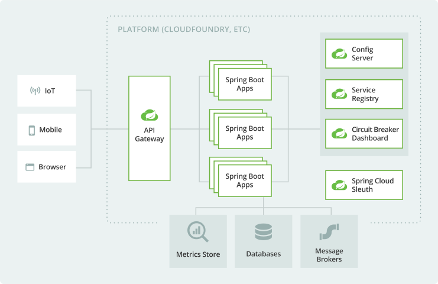

# Projeto de Microsserviços com Spring Boot

Neste projeto, você irá praticar a codificação de aplicações em que os domínios possam ser negocialmente isolados, criando assim, uma estrutura com microsserviços, cada um com responsabilidades bem definidas e individualmente escaláveis, utilizando as dependências do projeto Spring Cloud.

## Visão Geral da Arquitetura com Spring Cloud

Como mostra a figura a seguir, independente do client (IoT, Mobile ou Browser), os Microsserviços são "pequenos" apps Spring Boot, que podem ou não compartilhar bancos de dados, message brokers (caso haja implementação orientada a eventos), e até mesmo métricas. Porém, eles não estão diretamente disponíveis para os clients, sendo acessíveis por meio de um API Gateway, que pode acumular, além da responsabilidade de disponibilizar o acesso, funções relacionadas a segurança e balanceamento de carga.



Veja também que, ao lado dos microsserviços, temos alguns microsserviços de configuração, entre eles, o Config Server (responsável por distribuir as configurações de acordo com o ambiente - dev, homologação, produção, etc.), o Server Registry (responsável pela descoberta das instâncias de cada microsserviço), o Circuit Breaker (implementado para minimizar falhas dos microsserviços), e ainda o Sleuth (gerencia logs da aplicação).

No nosso exemplo, criaremos uma estrutura mínima contendo dois microsserviços, um Service Registry, um API Gateway.

## Criação dos Microsserviços

Nossos microsserviços serão aplicações Spring simplificadas, responsáveis por transmitir mensagens distintas de boas-vindas aos usuários. Para criar cada uma delas como um microsserviço, basta criar uma aplicação Spring por vez, por meio do site [Spring Initializr](https://start.spring.io/) ou pela sua IDE (Visual Studio Code, Eclipse ou IntelliJ), com as seguintes dependências:

- **Eureka Discovery Client**

    Dependência responsável por registrar o microsserviço no Service Registry, que será configurado mais a frente como um microsserviço de configuração.

- **Spring Boot Actuator**

    O Spring Boot Actuator inclui uma série de endpoints para o monitoramento de aplicações Spring Boot, como, por exemplo, `/actuator/health` para operação de health check, verificando se todas as configurações e dependências estão OK.

- **Spring Web**
  
    Possibilita a criação de endpoints GET, POST, PUT, PATCH e DELETE, em classes anotadas com `@RestController`.

No primeiro microsserviço, chamado `first-microservice`, configuramos o endpoint `GET /hello`:

`HelloController.java`

```java
package br.edu.uepb.example.firstmicroservice;

import org.springframework.web.bind.annotation.RequestMapping;
import org.springframework.web.bind.annotation.RestController;
import org.springframework.web.bind.annotation.GetMapping;

@RestController
@RequestMapping("/hello")
public class HelloController {
    
    @GetMapping
    public String getMessage() {
        return "Hello World";
    }
    
}
```

Na classe principal desse projeto, temos a presença da anotação `@EnableEurekaClient`.

`FirstMicroserviceApplication.java`

```java
package br.edu.uepb.example.firstmicroservice;

import org.springframework.boot.SpringApplication;
import org.springframework.boot.autoconfigure.SpringBootApplication;
import org.springframework.cloud.netflix.eureka.EnableEurekaClient;

@SpringBootApplication
@EnableEurekaClient
public class FirstMicroserviceApplication {

 public static void main(String[] args) {
  SpringApplication.run(FirstMicroserviceApplication.class, args);
 }

}
```

Por fim, temos o arquivo de configuração da aplicação, `application.yml` (o formato .yml é mais prático que o formato .properties), com as seguintes configurações: nome da aplicação, porta do servidor e endereço do Service Registry (Eureka). Nessa última configuração, note que estamos redirecionando para o endereço `http://localhost:9000/eureka`, que será configurado na aplicação de Service Registry.

`src\main\resources\application.yml`

```java
spring:
    application:
        name: first-service
server:
    port: 
        8081
eureka:
    instance:
        hostname: localhost
        port: 9000
    client:
        serviceUrl: 
            defaultZone: http://${eureka.instance.hostname}:${eureka.instance.port}/eureka
```

Você pode testar a aplicação, executando o projeto e acessando o endereço `http://localhost:8081/hello`.

No primeiro microsserviço, chamado `second-microservice`, configuramos o endpoint `GET /hi`:

`HiController.java`

```java
package br.edu.uepb.example.secondmicroservice;

import org.springframework.web.bind.annotation.GetMapping;
import org.springframework.web.bind.annotation.RequestMapping;
import org.springframework.web.bind.annotation.RestController;

@RestController
@RequestMapping("/hi")
public class HiController {
    
    @GetMapping
    public String getMessage() {
        return "Hi!";
    }
}
```

A disposição da classe principal é a mesma, com a anotação `@EnableEurekaClient`. Para o arquivo `application.yml`, as configuração são semelhantes, mudando apenas o nome da aplicação, que chamaremos de `second-service` e a porta, que não deve ser a mesma da aplicação anterior. Nesse caso, podemos configurar como 8082.

Você pode testar a aplicação, executando o projeto e acessando o endereço `http://localhost:8082/hi`.

Cada aplicação pode também ser testada com o Spring Boot Actuator, através da rota: `http://localhost:8081/actuator/health` (ou 8082, para a segunda aplicação).

## Criação do Service Registry

O Service Registry é responsável por gerenciar o status e a localização dos microsserviços de um ecossistema. Para tanto, os microsserviços devem se registrar individualmente no Service Registry.

Para configurar este microsserviço de configuração, basta gerar uma nova aplicação Spring com a dependência do **Eureka Server**, que será responsável por acolher todas as aplicações que desejarem se registrar e estarem disponíveis dentro da arquitetura.

Nisso, a aplicação, que chamaremos `discovery-service`, terá o seguinte arquivo de configuração:

`src\main\resources\application.yml`

```yml
spring:
    application:
        name: discovery-service
server:
    port: 9000

eureka:
    instance:
        hostname: localhost
    client:
        registerWithEureka: false
        fetchRegistry: false
        service-url:
            defaultZone: http://${eureka.instance.hostname}:${server.port}/eureka
```

Além das mesmas configurações do nome da aplicação e da porta do servidor, veja as configurações do Eureka: temos a URL de serviço, o hostname do servidor, e duas configurações adicionais, marcadas como `false`, que impedem que o microsserviço se registre nele mesmo (fetchRegistry) e obtenha informações para se registrar (registerWithEureka).

A classe princiapl dessa aplicação estará configurada da seguinte forma:

`DiscoveryServiceApplication.java`

```java
package br.edu.uepb.example.discoveryservice;

import org.springframework.boot.SpringApplication;
import org.springframework.boot.autoconfigure.SpringBootApplication;
import org.springframework.cloud.netflix.eureka.server.EnableEurekaServer;

@SpringBootApplication
@EnableEurekaServer
public class DiscoveryServiceApplication {

 public static void main(String[] args) {
  SpringApplication.run(DiscoveryServiceApplication.class, args);
 }

}
```

Note que a anotação que denota a configuração do Eureka mudou, dado que esta aplicação é um Service Registry: `@EnableEurekaServer`.

Você pode testar a aplicação, parando a execução dos dois primeiros microsserviços e executando este projeto. Em seguida, é possível acessar o endereço `http://localhost:9000`. Verifique em seu navegador a seguinte tela:


Ao executar os dois projetos anteriores novamente, será possível ver que eles se registraram no Eureka Server:


Observe que, durante a inicialização de cada um projetos, é exibido, no log do DEBUG CONSOLE ou do TERMINAL, algo semelhante ao código a seguir:

```console
INFO 12460 --- [nfoReplicator-0] com.netflix.discovery.DiscoveryClient    : DiscoveryClient_SECOND-SERVICE/localhost:second-service:8082 - registration status: 204
```

Caso apareça algum aviso em vermelho, uma das aplicações pode não estar com as dependências bem configuradas, ou será por conta que estamos usando uma configuração muito simplificada, até aqui, de microsserviços.

Note que, cada microsserviço é registrado com letras maiúsculas. Isso será importante para a configuração feita a seguir.

## Criação do Gateway

Um gateway tem a função de encapsular a(s) arquitetura(s) da solução e fornecer uma interface de uso para os clientes externos. Nesse contexto, o gateway ainda pode acumular outras responsabilidades, como, por exemplo, autenticação, monitoramento e balanceamento de carga.

Esta aplicação terá como dependências o **Eureka Discovery Client** e o **Spring Boot Actuator**.

De forma semelhante aos microsserviços, a classe principal também terá a anotação `@EnableEurekaClient`.

Já a classe de configuração terá a presença de uris dos microsserviços, na parte de configurações de cloud, conforme registrado no Eureka Server:

`src\main\resources\application.yml`

```yml
server:
    port: 8080

eureka:
    instance:
        hostname: localhost
        port: 9000
    client:
        serviceUrl: 
            defaultZone: http://${eureka.instance.hostname}:${eureka.instance.port}/eureka

spring:
    application:
        name: gateway-service
    cloud:
        gateway:
            routes:
            - id: helloModule
              uri: lb://FIRST-SERVICE
              predicates:
              - Path=/hello-message/**
            - id: hiModule
              uri: lb://SECOND-SERVICE
              predicates:
              - Path=/hi-message/**
```

Note que, para cada rota, foi inserido o prefixo `lb`, de *load balance*, seguido do nome conforme registrado no Eureka Server. Além disso, há um conjunto de `predicates`, que são as URLs de máscara, que estarão disponíveis para os clients.

Logo, com o projeto do gateway em execução, você pode acessar a rota `http://localhost:8080/hello-message` ao invés de `http://localhost:8081/hello`, e `http://localhost:8080/hi-message` ao invés de `http://localhost:8082/hi`.

Isso é útil quando temos a presença de configuração de várias instâncias do mesmo microsserviço, como é prática no mercado. Afinal, esse é o propósito deste tipo de arquitetura.
